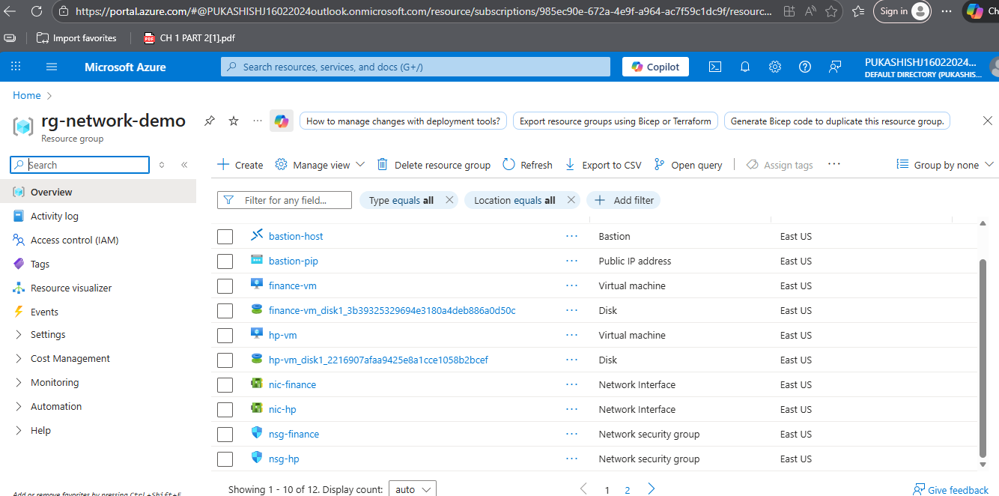
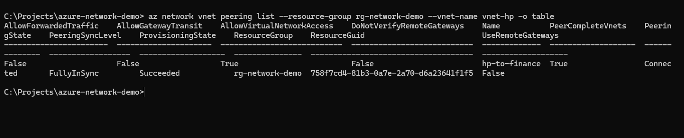
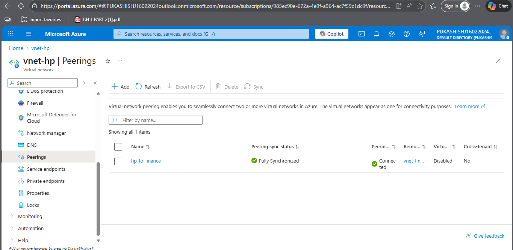

# Design and Implementation of Private Azure VNets with VNet Peering

## 📌 Overview
This project demonstrates how to establish secure communication between two isolated Azure Virtual Networks (VNets) using **VNet Peering**.  
The scenario represents a real-world enterprise environment where the **HR** and **Finance** teams operate in separate networks but need to communicate privately.

The project focuses on **private connectivity**, avoiding public IP exposure, which is a best practice in cloud environments.

---

## 🏗️ Architecture Design

- Two separate VNets:
  - **HR-VNet**
  - **Finance-VNet**
- Each VNet contains:
  - One **private subnet**
  - One **private Virtual Machine (VM)**
- VNet Peering enabled between HR and Finance VNets
- Communication tested using **ping (ICMP)**

> In a real-world scenario, private applications or internal services would communicate instead of ping.

---

## 🖼️ Architecture Diagram & Resource Group Overview

This section provides an overview of all Azure resources and networking configurations created for this project.

### 🔹 Resource Group and Deployed Resources

### 🔹 VNet Peering Configuration (CLI / Portal)

### 🔹 VNet Peering Status – Connected

